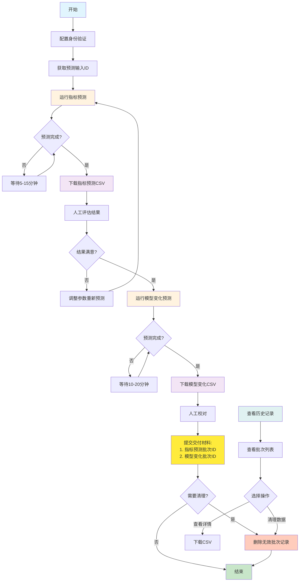

# AI 预测系统 API 使用指南

## 概览

本文档为运营人员提供使用 Swagger UI 调用 AI 预测系统 API 的详细指南。该系统通过两个阶段的 AI 预测来生成健康指标变化和 3D 模型调整建议。

## 前置条件

### 1. 访问 Swagger UI
访问系统的 Swagger UI 界面：[https://jakiro-api-test.id.life/api](https://jakiro-api-test.id.life/api)

### 2. 身份验证设置
在 Swagger UI 页面顶部，点击 "Authorize" 按钮，在 `X-Internal-Token` 字段中输入：
```
sLVYKrC7YcpJ5Vuus/rH/UUvo6Cmb4OtRrFDjA4q7YQ=
```

⚠️ **重要提醒**：请妥善保管访问令牌，不要与非授权人员分享。

## 完整工作流程

## 流程图




### 阶段一：健康指标预测生成

#### 步骤 1：运行指标预测
使用 `POST /ai-indicator-prediction/predict` 端点 📍 [在 Swagger UI 中查看](https://jakiro-api-test.id.life/api#/AI%20Indicator%20Prediction/AiIndicatorPredictionController_predictIndicators)

**必需参数：**
- `predictInputId`: 预测输入 ID （后端会提供）
- `age`: 用户年龄（例如：35）
- `gender`: 用户性别（"Male" 或 "Female"）

**可选参数（和CLI相同，可以留空）：**
- `modelProvider`: AI 模型提供商（"openai" 或 "anthropic"）
- `temperature`: 模型创造性参数（0.0-1.0）
- `maxTokens`: 最大生成长度
- `maxIndicators`: 最大处理指标数
- `batchSize`: 批处理大小

**请求示例：**
```json
{
  "predictInputId": 2,
  "age": 35,
  "gender": "Male",
  "modelProvider": "anthropic",
  "maxIndicators": 200,
  "batchSize": 50
}
```

⏱️ **注意**：此操作可能需要 5-15 分钟，请保持网络连接稳定，不要关闭浏览器页面。

**响应结果：**
系统将返回一个批次 ID (batchId)，请记录此 ID 用于后续步骤。

#### 步骤 2：下载指标预测结果进行评估
使用 `GET /ai-indicator-prediction/batch/{batchId}/predictions/csv` 端点 📍 [在 Swagger UI 中查看](https://jakiro-api-test.id.life/api#/AI%20Indicator%20Prediction/AiIndicatorPredictionController_exportBatchPredictionsAsCsv)

将步骤 1 返回的 batchId 填入路径参数中，点击 "Try it out" 下载 CSV 文件。

**CSV 文件内容：**
- 预测的健康指标变化
- 指标正常/异常状态
- 置信度评分
- 临床意义说明

请仔细审核下载的结果，确认预测质量后再进行下一步。

### 阶段二：3D 模型变化预测

#### 步骤 3：运行模型变化预测
使用 `POST /ai-model-change/predict` 端点 📍 [在 Swagger UI 中查看](https://jakiro-api-test.id.life/api#/AI%20Model%20Change%20Prediction/ModelChangeController_predictModelChangesFromBatch)

**必需参数：**
- `batchId`: 步骤 1 返回的指标预测批次 ID

**可选参数：**
- `modelProvider`: AI 模型提供商（"openai" 或 "anthropic"）
- `temperature`: 模型创造性参数
- `maxTokens`: 最大生成长度
- `batchSize`: 批处理大小
- `abnormalOnly`: 仅处理异常指标

**请求示例：**
```json
{
  "batchId": 456,
  "modelProvider": "openai",
  "batchSize": 20,
  "abnormalOnly": false
}
```

⏱️ **注意**：此操作可能需要 10-20 分钟，请保持网络连接稳定。

**响应结果：**
系统将返回一个模型变化批次 ID，请记录此 ID。

#### 步骤 4：下载模型变化预测结果
使用 `GET /ai-model-change/batch/{batchId}/export/csv` 端点 📍 [在 Swagger UI 中查看](https://jakiro-api-test.id.life/api#/AI%20Model%20Change%20Prediction/ModelChangeController_exportModelChangesAsCsv)

将步骤 3 返回的模型变化批次 ID 填入路径参数中，下载 CSV 文件。

**CSV 文件内容：**
- 3D 模型调整建议
- 视觉变化描述
- 相关健康指标关联
- 变化程度评估

## 管理功能

### 查看历史记录

#### 浏览所有生成记录
使用以下接口可以查看所有历史生成记录，方便追踪和管理：

- **指标预测批次列表**：`GET /ai-indicator-prediction/batches`
  - 显示所有指标预测批次
  - 包含批次ID、创建时间、状态等信息
  - 可通过 `predictInputId` 参数过滤特定用户的记录
  - 📍 [在 Swagger UI 中查看](https://jakiro-api-test.id.life/api#/AI%20Indicator%20Prediction/AiIndicatorPredictionController_listBatches)

- **模型变化批次列表**：`GET /ai-model-change/batches`  
  - 显示所有模型变化预测批次
  - 包含批次ID、源指标批次ID、创建时间等信息
  - 可通过 `sourceBatchId` 参数过滤特定指标批次的关联记录
  - 📍 [在 Swagger UI 中查看](https://jakiro-api-test.id.life/api#/AI%20Model%20Change%20Prediction/ModelChangeController_listBatches)

**使用场景：**
- 查找历史预测记录
- 确认批次处理状态
- 获取批次ID用于下载或清理
- 统计使用情况

### 数据清理功能

在完成交付后，可以清理无效或测试数据，保持系统整洁：

#### 单个批次删除
- **删除指定指标批次**：`DELETE /ai-indicator-prediction/batch/{batchId}`
- **删除指定模型变化批次**：`DELETE /ai-model-change/batch/{batchId}`

#### 批量清理
- **删除用户所有指标批次**：`DELETE /ai-indicator-prediction/batches/input/{predictInputId}`
  - 清理特定用户的所有指标预测记录
  - 适用于重新开始或清理测试数据

- **删除关联的模型变化批次**：`DELETE /ai-model-change/batches/prediction-source/{sourceBatchId}`
  - 删除与特定指标批次相关的所有模型变化预测
  - 保证数据一致性

**清理建议：**
1. 交付完成后，保留最终版本，删除中间测试版本
2. 定期清理失败或中断的批次
3. 删除前先下载备份重要数据

## 最终交付

完成所有步骤后，请提供以下信息给相关技术人员：
- **指标预测批次 ID**：步骤 1 生成的 batchId
- **模型变化预测批次 ID**：步骤 3 生成的 batchId

