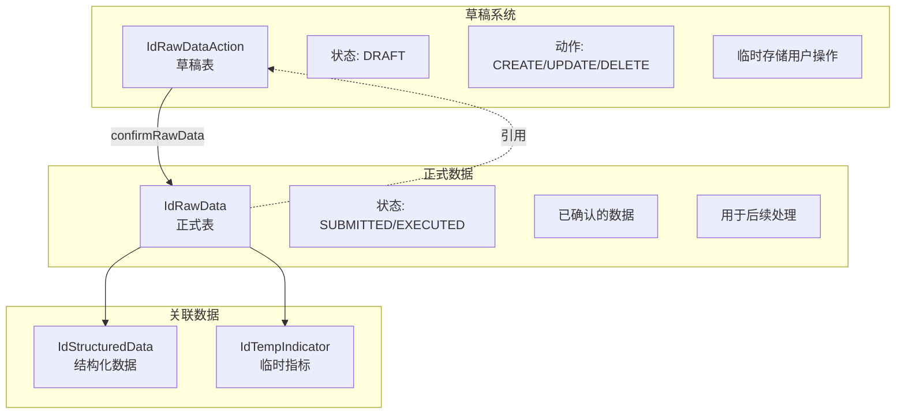
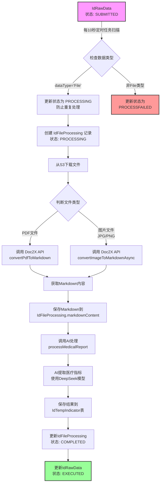
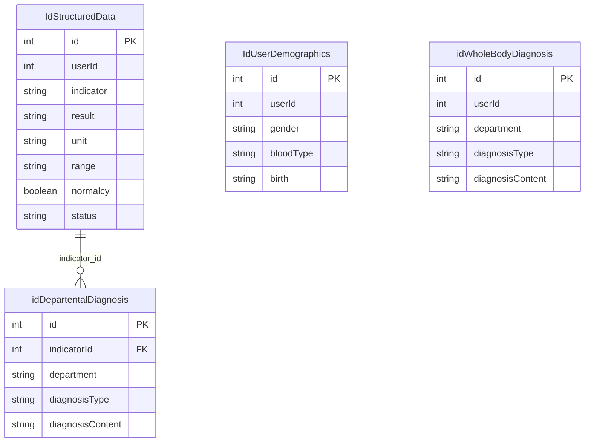

# 医疗数据处理服务

- 输入：用户提供的原始医疗数据（纸质报告/人工输入）
- 输出：
	- 标准化医疗数据
	- 医疗数据可视化（标记对应模型）
	- 多学科会诊报告

## 改进方向

- 医疗数据提取
  - **LangExtract**：LangExtract具备受控生成、长上下文分块、并行处理以及精确来源定位（字符偏移）等核心能力，有效支撑数据追溯和质量检验需求。[参考资料](https://developers.googleblog.com/en/introducing-langextract-a-gemini-powered-information-extraction-library/)
  - **报告类型差异化处理**：不同类别数据不能够轻易混用
    - **定量指标处理**：强制要求`indicator/result(unit)/range(normal/abnormal)/normalcy/result_time`等字段完整；建立单位换算体系、数值区间标准化规则；
    - **定性指标处理**：对`result`字段进行离散化处理，支持阴性、阳性、弱阳性、未检出等标准化取值；建立相应的解释模板库；
    - **遗传测序处理**：核心实体包括`variant`（涵盖基因、转录本、cDNA/protein、杂合性、ClinVar/ACMG分级、VAF等）、`panel`、检测方法学以及质量控制指标
    - **影像/超声/放射学处理**：重点抽取`finding`（包括病变部位、侧别、尺寸、形态特征）、`impression`诊断印象以及`recommendation`
    - **病理检查处理**：结构化提取诊断结论、肿瘤分级分期、免疫组化结果以及分子标志物等关键信息；
- **模型匹配**：
  - 解耦目前 OCR 抽取与模型匹配的流程
  - **归类与匹配优化**: 并非每个指标都需要匹配模型，或有明确的与特定器官相关的生理学意义。考虑使用白名单？
- **诊断流程优化**
  - **引用链接**: 为每项建议提供"原因解释+原文高亮"的引用链接，最大程度降低用户误解风险。
  - **科室配置管理**：精简`departments`配置，避免科室分类过于冗余
  - **自动质检机制**：
    - 事实一致性验证：确保诊断结论与检测数值范围保持逻辑一致，避免出现"结果低于正常下限却判断为正常"等矛盾情况。
    - 证据链追溯：诊断报告中的关键结论必须能够追溯到`IdStructuredData`中的原始数据。
    - 诊断充分性检查：对于异常指标，系统需至少生成N个相关科室的"初步诊断+治疗建议"。
  - **普通人友好版本 vs 专业版本**：
    - 普通人友好版本：采用生活化语言描述，标注风险等级，提供具体的后续建议（包括复查安排、就医科室推荐、生活方式调整等）。
    - 专业版本：采用专业术语描述，提供详细的诊断结论和治疗建议。

- 多Agent总体架构
  - **OCR解析Agent**：负责PDF和图片的Markdown文本解析，将结构化表格提取为表格块，保留页面编号和字符区间索引以便后续追溯定位。
  - **报告类型分类Agent**：按照报告类型进行智能路由，包括生化指标（定量/定性）、遗传基因、影像、病理、超声等各类报告。
  - **信息抽取Agent（基于LangExtract）**：根据不同报告类型加载相应的schema和few-shot示例，精确抽取指标、实体及其关系，写入临时存储表，并保留源位置信息。
  - **数据校验与规范化Agent**：统一处理`indicator/result/unit/range/normalcy`等字段格式，对数值范围进行JSON标准化，执行单位换算和小数精度校正，完成LOINC/SNOMED等医学标准词表的映射工作。
  - **模型映射Agent**：将符合条件的指标映射至3D解剖模型，该步骤采用松耦合设计，映射失败不会影响主流程运行，仅记录告警信息。
  - **质量评估Agent**：自动评估数据抽取和诊断的质量水平，包括置信度评分、覆盖率统计、冲突检测以及与原始文本的对齐度分析，为非专业用户提供易懂的解释和后续建议。
  - **诊断编排Agent**：针对异常指标生成多科室诊断意见并进行综合诊断汇总，内置自动化质检和事实一致性验证机制，同时输出专业版和大众友好版两套诊断报告。
  - **人工复核机制**：当系统置信度较低、存在诊断冲突或检出高风险指标时，自动转入人工复核流程，复核结果将反馈用于优化few-shot样例和词表内容。

## 现有架构

- 流程
	1. [用户提供原始报告](#用户提供原始报告): Raw Data Service 处理
	2. [提取数据](#提取数据)：存储至 `IdStructuredData`
	3. 下游处理
		- 归类，对应指标到解剖模型（目前在[提取数据](#提取数据)过程中顺便做了）
		- [多学科会诊报告](#多学科会诊报告)

### 用户提供原始报告

Raw Data Service 提供草稿上传及确认的功能，接受用户上传的医疗数据。

[草稿上传界面，Save Changes触发`confirmRawData`](CleanShot%202025-08-12%20at%2010.19.56@2x.png)

实现了一个**双表草稿系统**，将正式数据（`IdRawData`）和草稿数据（`IdRawDataAction`）分离管理




### 提取数据

目前使用 `jakiro-report-vault` 服务OCR提取 + 人工校对实现

- `jakiro-report-vault` 负责处理提交的 `IdRawData` (`status = SUBMITTED` )
	- 目前通过 CRON 10s 定期扫描实现，没有使用 hooks 触发
	- [Jakiro Report Vault 数据处理流程概览](#Jakiro%20Report%20Vault%20数据处理流程概览)
	- 输出
		- 结果存储在 `IdTempIndicator`，同步输出 csv/json 至 src/medical-report/reports 下供人工审核
		- 更新 `IdRawData` (`status = EXECUTED` )
- 人工审核
	- 校对指标
		- `range` 需要 json 格式化，但是依赖人工手敲json很不可靠
	- 校对AI生成的 `category`, `subcategory`, `model_category` 是否正确
	- 确认医疗数据的报告时间 `result_time`
	- 匹配 `loinc_code`
- 确认后交付后端手动上传
	- 具体流程？是只修改 `IdStructuredData` 吗？ #question

#### Jakiro Report Vault 数据处理流程概览



### 多学科会诊报告

主要由 `jakiro-backend` 的 `AiDiagnosisService` 通过GPT-4.1模型进行多维度医学分析

1. **[生成异常指标诊断](#生成异常指标诊断流程)**: 为每个异常指标生成多个相关科室的初步诊断和治疗建议（存储到`idDepartentalDiagnosis`表）
2. **[生成整体诊断](#生成整体诊断流程)**: 基于每个异常指标的科室诊断结合用户人口学信息（性别、血型、出生日期）生成各科室的综合诊断报告（存储到`idWholeBodyDiagnosis`表）

最终输出包含52个医学科室视角的个性化健康分析报告

其通过内部 REST API 端点触发，主要提供以下接口

| 端点                                              | 方法   | 功能     | 触发服务方法                           |
| ----------------------------------------------- | ---- | ------ | -------------------------------- |
| `/ai-diagnosis/run-departmental-diagnosis`      | POST | 运行科室诊断 | `runDepartmentalAnalysis()`      |
| `/ai-diagnosis/overall-diagnosis`               | POST | 生成整体诊断 | `overallDiagnosis()`             |
| `/ai-diagnosis/get-departmental-diagnosis-data` | GET  | 获取诊断数据 | `getDepartmentalDiagnosisData()` |


#### 核心数据表关系


- IdUserDemographics 存储用户基础信息（目前包括性别、血型、出生日期）
	- 目前是如何导入的？人工导入吗？ #question 

#### 生成异常指标诊断流程

1. **数据获取**
   - 查询用户所有 `ACTIVE` 状态的结构化数据
   - 按 `indicator-unit` 组合分组，保留最新数据
   - 筛选出异常指标（`normalcy = false`）
2. **AI 分析**
   - 使用 GPT-4.1 模型（temperature=0.7）
   - 为**每个异常指标**生成多科室诊断
   - 每个科室生成"初步诊断"和"治疗建议"两种类型
	   - `diagnosis_type = "Preliminary Diagnosis" / "Treatment Advice"`
   - 结果存储到 `idDepartentalDiagnosis`

#### 生成整体诊断流程

1. **用户信息获取**
   - 查询 `idUserDemographics` 获取性别、血型、出生日期
2. **科室数据聚合**
   - 获取所有科室诊断数据及关联的指标信息
   - 按科室（department）分组
3. **综合诊断生成**
   - 为每个科室调用 AI 生成综合报告
   - 包含"初步诊断"和"治疗建议"两部分
   - 结果存储到 `idWholeBodyDiagnosis`

#### 科室分类

目前系统支持52个医学科室的诊断分析（代码定义: `jakiro-backend/src/ai-chat/ai-diagnosis.service.ts:14-53`）：

```json
[
  "General Internal Medicine",
  "Rheumatology",
  "Hematology",
  "Infectious Diseases",
  "Hypertension",
  "Sleep Medicine",
  "Pulmonology",
  "Endocrinology",
  "Neurology",
  "Nephrology",
  "Gastroenterology",
  "Cardiovascular Medicine",
  "Hematology",
  "General Surgery",
  "Orthopedics",
  "Hepatobiliary Surgery",
  "Orthopedics Oncology",
  "Spine Surgery",
  "Urology",
  "Breast Surgery",
  "Neurosurgery",
  "Pain Medicine",
  "Gastrointestinal Surgery",
  "Cardiovascular Surgery",
  "Thoracic Surgery",
  "Endocrine Surgery",
  "Otolaryngology (ENT)",
  "Dermatology",
  "Sports Medicine",
  "Dermatology",
  "Oncology",
  "Ophthalmology",
  "Dentistry",
  "Psychiatry",
  "Rehabilitation Medicine",
  "Laboratory Medicine and Pathology",
  "Clinical Nutrition",
  "Obstetrics and Gynecology"
]
```

